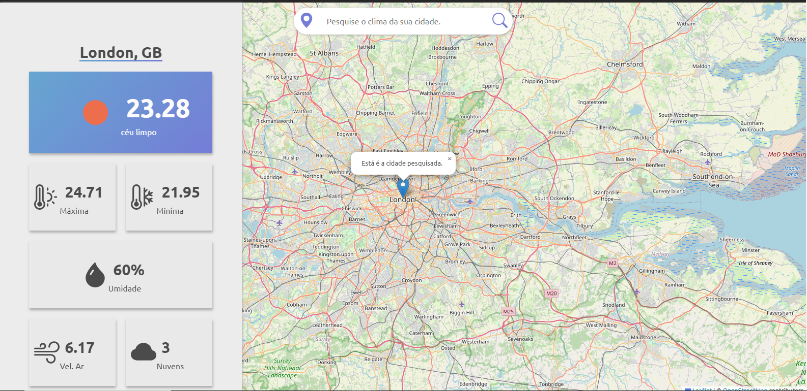

# Weather Consult

## Técnologias utilizadas
Nesse micro-serviço, integramos algumas funções do Open Street Map e do Open Weather API. Veja a seguir uma breve descrição. 

### Leaflet
O Leaflet é uma interface de mapa integrada ao Open Street Map. Na qual utilizamos como retorno de uma busca realizada na barra de pesquisa.

### Open Weather API
O Open Weather API, é uma REST API de uso aberto na qual retorna um JSON com informações climáticas.

## Open-Source
O código é aberto para qualquer tipo de uso e para qualquer usuário, para utilizá-lo, será necessário referênciar o criador original dentro da documentação ([Matheus Caprioli](https://github.com/Matheus-Pedro)).

## Como utilizar
Basta criar uma chave de API no Open Weather API e adiciona-lá na string `API_key` em `script.js`.
